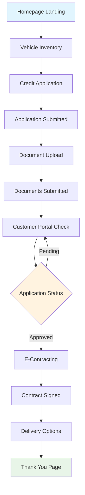
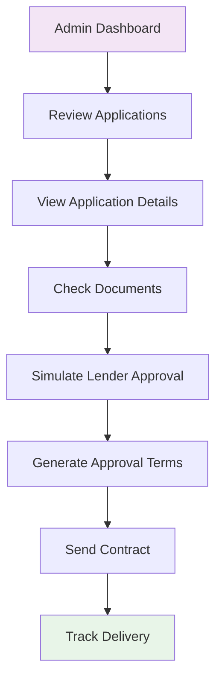
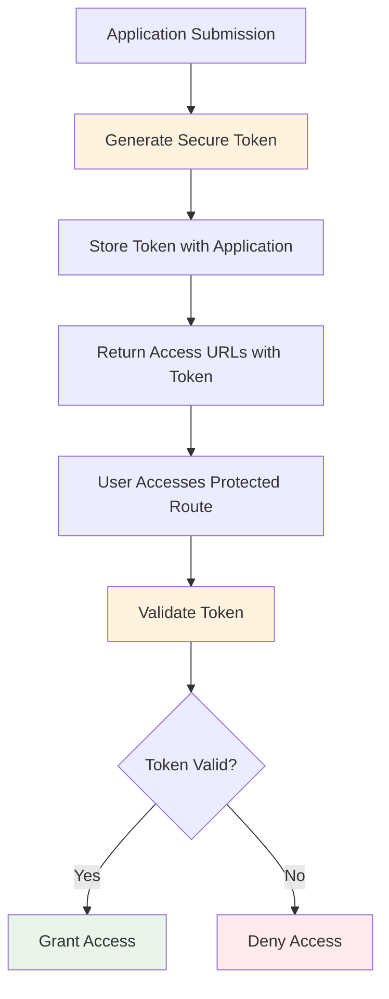
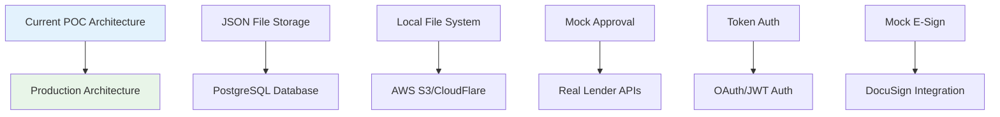
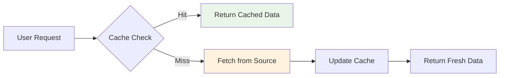
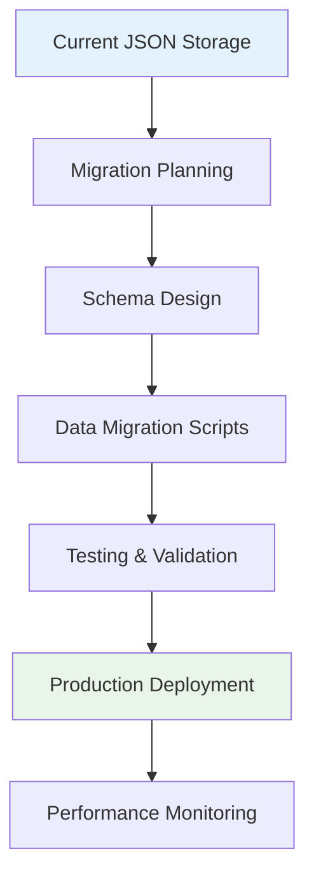
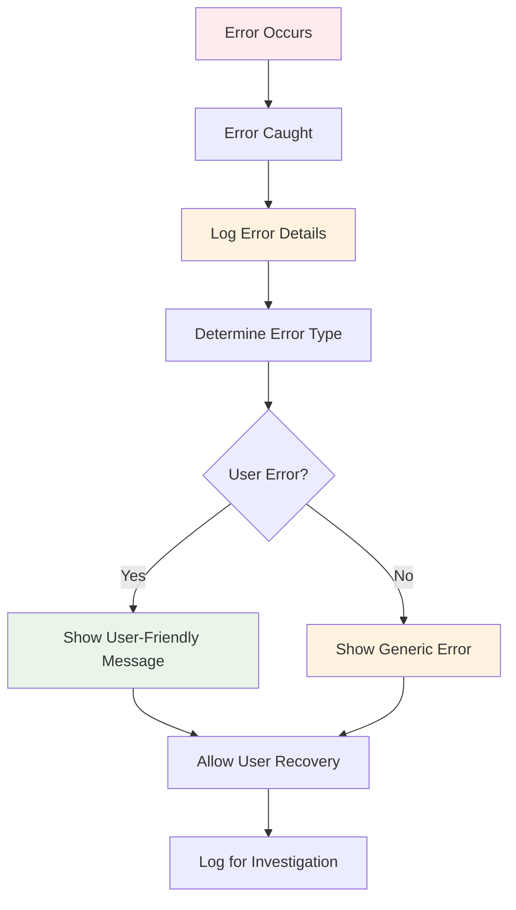

# AutoFlow - Architecture Documentation

This document outlines the current architecture of the AutoFlow platform, including system design, data flow, and component relationships.

---

## System Overview

AutoFlow is built as a modern Next.js application with a modular architecture that separates concerns between user interface, business logic, data persistence, and external integrations.

### High-Level Architecture

```
┌─────────────────────────────────────────────────────────────┐
│                    AutoFlow Platform                        │
├─────────────────────────────────────────────────────────────┤
│  Frontend Layer (Next.js App Router + Tailwind CSS)        │
│  ┌─────────────┐ ┌─────────────┐ ┌─────────────────────┐   │
│  │  Customer   │ │   Admin     │ │    Shared           │   │
│  │  Interface  │ │  Dashboard  │ │   Components        │   │
│  └─────────────┘ └─────────────┘ └─────────────────────┘   │
├─────────────────────────────────────────────────────────────┤
│  API Layer (Next.js Route Handlers)                        │
│  ┌─────────────┐ ┌─────────────┐ ┌─────────────────────┐   │
│  │ Application │ │ File Upload │ │   Approval &        │   │
│  │   Management│ │   & Serving │ │   Contract APIs     │   │
│  └─────────────┘ └─────────────┘ └─────────────────────┘   │
├─────────────────────────────────────────────────────────────┤
│  Business Logic Layer                                      │
│  ┌─────────────┐ ┌─────────────┐ ┌─────────────────────┐   │
│  │ Application │ │   Approval  │ │   File & Document   │   │
│  │    Store    │ │ Simulation  │ │     Management      │   │
│  └─────────────┘ └─────────────┘ └─────────────────────┘   │
├─────────────────────────────────────────────────────────────┤
│  Data Layer                                                 │
│  ┌─────────────┐ ┌─────────────┐ ┌─────────────────────┐   │
│  │ JSON File   │ │ File System │ │   Mock Vehicle      │   │
│  │ Persistence │ │   Storage   │ │      Data           │   │
│  └─────────────┘ └─────────────┘ └─────────────────────┘   │
└─────────────────────────────────────────────────────────────┘
```

---

## Application Flow Architecture

### Customer Journey Flow



### Admin Workflow



---

## Technical Architecture

### Frontend Architecture

```
Frontend (Next.js App Router)
├── app/                           # App Router pages
│   ├── (customer-facing)/
│   │   ├── page.tsx              # Homepage
│   │   ├── inventory/            # Vehicle browsing
│   │   ├── apply/                # Credit application
│   │   ├── upload-documents/     # Document submission
│   │   ├── portal/               # Customer portal
│   │   ├── e-contracting/        # Contract management
│   │   └── delivery-options/     # Delivery selection
│   ├── (admin)/
│   │   └── admin/review/         # Admin dashboard
│   ├── api/                      # API routes
│   └── components/               # Shared components
├── lib/                          # Utilities & data
└── public/                       # Static assets
```

### Component Hierarchy

```
App Layout
├── Navigation Component
├── Page Components (Server Components)
│   ├── Interactive Client Components
│   │   ├── Form Components
│   │   ├── Upload Components
│   │   └── Status Components
│   └── Display Components
└── Footer Component
```

### API Architecture

```
API Layer (/api/)
├── /upload                       # File upload handling
├── /files/[filename]            # File serving
├── /lender-approval             # Approval simulation
├── /applications/search         # Application lookup
├── /contract-status             # Contract management
└── /delivery-choice             # Delivery options
```

---

## Data Architecture

### Data Flow Diagram

```mermaid
graph LR
    A[User Input] --> B[Client Validation]
    B --> C[Server Action/API]
    C --> D[Server Validation]
    D --> E[Business Logic]
    E --> F[Data Store Update]
    F --> G[File Persistence]
    G --> H[Response to Client]
    H --> I[UI Update]
    
    style A fill:#e3f2fd
    style E fill:#fff3e0
    style G fill:#e8f5e8
    style I fill:#f3e5f5
```



### Data Models

#### Application Data Structure
```typescript
interface CreditApplication {
  // Identity
  id: number;
  token: string;
  submittedAt: Date;
  
  // Personal Information
  firstName: string;
  lastName: string;
  email: string;
  phone: string;
  
  // Employment Information
  annualIncome: string;
  employmentStatus: string;
  employer: string;
  jobTitle: string;
  
  // Vehicle Information
  selectedVehicle?: VehicleSelection;
  
  // Process Status
  status: ApplicationStatus;
  uploadedDocuments?: UploadedDocument[];
  approvalTerms?: ApprovalTerms;
  
  // Delivery Information
  deliveryChoice?: DeliveryChoice;
  deliveryDetails?: DeliveryDetails;
}
```

#### File Storage Structure
```typescript
interface UploadedDocument {
  originalName: string;      // User-provided filename
  filename: string;          // Server-generated unique filename
  path: string;             // File system path
  fieldName: string;        // Document type identifier
  uploadedAt: Date;         // Upload timestamp
}
```

### Data Persistence Strategy

```
Data Storage Architecture
├── In-Memory Cache (Runtime)
│   ├── Fast read/write operations
│   ├── Application state management
│   └── Session-based data handling
├── JSON File Storage (Persistent)
│   ├── .applications.json (Application data)
│   ├── Backup files (.backup.timestamp)
│   └── Automatic corruption recovery
└── File System Storage
    ├── /public/uploads/ (Document files)
    ├── Unique filename generation
    └── Direct URL access
```

---

## Security Architecture

### Security Layers

```
Security Implementation
├── Input Validation
│   ├── Client-side form validation
│   ├── Server-side data validation
│   └── File type/size validation
├── Authentication & Authorization
│   ├── Token-based application access
│   ├── URL parameter security
│   └── Session management
├── File Security
│   ├── File type restrictions
│   ├── Size limitations
│   ├── Unique filename generation
│   └── Secure file serving
└── Data Protection
    ├── Input sanitization
    ├── SQL injection prevention
    └── XSS protection
```

### Token-Based Access Control



---

## Integration Architecture

### Current Integration Points

```
Integration Layer
├── Frontend Integrations
│   ├── Unsplash (Vehicle images)
│   ├── Lucide React (Icons)
│   └── Framer Motion (Animations)
├── Internal APIs
│   ├── Vehicle data (Mock)
│   ├── Application processing
│   └── File management
└── Future Integration Points
    ├── Credit bureau APIs
    ├── Lender systems
    ├── E-signature platforms
    ├── Payment processing
    └── Delivery tracking
```

### Production Migration Architecture



---

## Performance Architecture

### Optimization Strategy

```
Performance Optimizations
├── Frontend Performance
│   ├── Next.js App Router (SSR/SSG)
│   ├── Automatic code splitting
│   ├── Image optimization
│   ├── Lazy loading components
│   └── Minimal JavaScript bundles
├── Backend Performance
│   ├── In-memory caching
│   ├── Efficient file handling
│   ├── Streaming for large files
│   └── Optimized data queries
└── Network Performance
    ├── CDN for static assets
    ├── Gzip compression
    ├── Optimized API responses
    └── Efficient caching headers
```

### Caching Strategy



---

## Scalability Architecture

### Current Limitations & Solutions

```
Scalability Considerations
├── Current Bottlenecks
│   ├── JSON file I/O operations
│   ├── Single-server file storage
│   ├── In-memory cache limitations
│   └── No horizontal scaling
├── Scaling Solutions
│   ├── Database migration (PostgreSQL)
│   ├── Cloud file storage (S3)
│   ├── Redis for distributed caching
│   ├── Load balancing
│   └── Microservices architecture
└── Growth Planning
    ├── Container orchestration
    ├── Auto-scaling groups
    ├── CDN integration
    └── Performance monitoring
```

### Database Migration Strategy



---

## Error Handling Architecture

### Error Management Strategy

```
Error Handling Layers
├── Client-Side Errors
│   ├── Form validation errors
│   ├── Network request failures
│   ├── File upload errors
│   └── User-friendly error messages
├── Server-Side Errors
│   ├── API endpoint errors
│   ├── File system errors
│   ├── Data validation errors
│   └── Business logic errors
├── System-Level Errors
│   ├── File corruption handling
│   ├── Automatic backup/recovery
│   ├── Service unavailability
│   └── Graceful degradation
└── Monitoring & Logging
    ├── Error tracking
    ├── Performance monitoring
    ├── User behavior analytics
    └── System health checks
```

### Error Flow Diagram



---

## Deployment Architecture

### Current Deployment Model

```
Development Environment
├── Local Development
│   ├── Next.js dev server
│   ├── Local file storage
│   ├── JSON data persistence
│   └── Hot module reloading
├── Testing Environment
│   ├── Production build testing
│   ├── File upload testing
│   ├── End-to-end testing
│   └── Performance testing
└── Production Preparation
    ├── Environment configuration
    ├── Security hardening
    ├── Performance optimization
    └── Monitoring setup
```

### Future Production Architecture

```mermaid
graph TB
    A[Load Balancer] --> B[Web Server Cluster]
    B --> C[Application Servers]
    C --> D[Database Cluster]
    C --> E[File Storage (S3)]
    C --> F[Cache Layer (Redis)]
    
    G[Monitoring] --> C
    H[Logging] --> C
    I[Security] --> A
    
    style A fill:#e3f2fd
    style C fill:#fff3e0
    style D fill:#e8f5e8
    style E fill:#f3e5f5
```

---

## Component Communication Architecture

### Inter-Component Communication

```
Component Communication Patterns
├── Parent-Child Communication
│   ├── Props passing (downward)
│   ├── Callback functions (upward)
│   └── Context API (cross-cutting)
├── Server-Client Communication
│   ├── Server Actions (form submissions)
│   ├── API routes (complex operations)
│   └── Server Components (SSR data)
├── State Management
│   ├── React useState (local state)
│   ├── URL parameters (navigation state)
│   └── Server state (persistent data)
└── Event Handling
    ├── Form submissions
    ├── File uploads
    ├── Navigation events
    └── Error boundaries
```

### Data Flow Patterns

```mermaid
graph LR
    A[User Action] --> B[Event Handler]
    B --> C[State Update]
    C --> D[Component Re-render]
    D --> E[Server Action/API Call]
    E --> F[Server Processing]
    F --> G[Data Persistence]
    G --> H[Response]
    H --> I[UI Update]
    
    style A fill:#e3f2fd
    style E fill:#fff3e0
    style G fill:#e8f5e8
    style I fill:#f3e5f5
```



---

## Future Architecture Considerations

### Planned Enhancements

1. **Microservices Migration**
   - Separate application processing service
   - Dedicated file management service
   - Independent approval simulation service
   - Contract management service

2. **Real-time Features**
   - WebSocket connections for live updates
   - Real-time application status tracking
   - Live chat support integration
   - Push notifications

3. **Advanced Security**
   - OAuth2/OIDC integration
   - Role-based access control
   - Audit logging and compliance
   - Advanced threat protection

4. **Analytics & Monitoring**
   - User behavior analytics
   - Performance monitoring
   - Business intelligence dashboards
   - Predictive analytics

5. **Mobile Architecture**
   - React Native mobile app
   - Progressive Web App features
   - Offline functionality
   - Mobile-optimized workflows

---

*This architecture document represents the current technical design of AutoFlow and provides a roadmap for future scalability and enhancement.* 